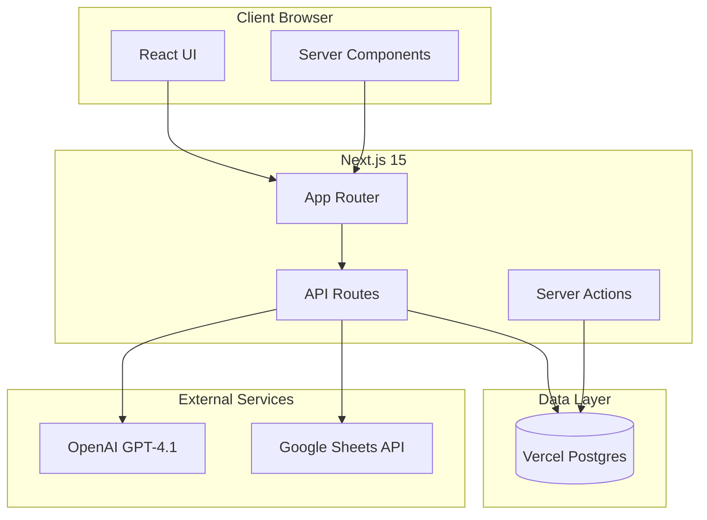
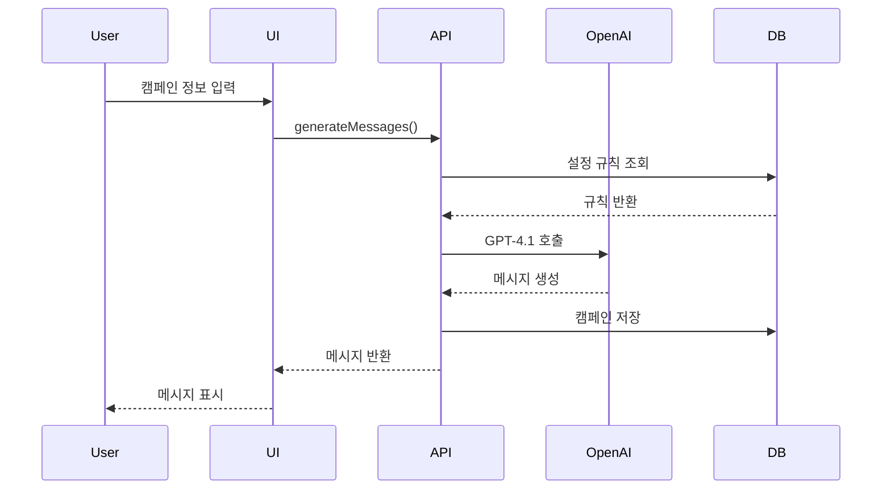
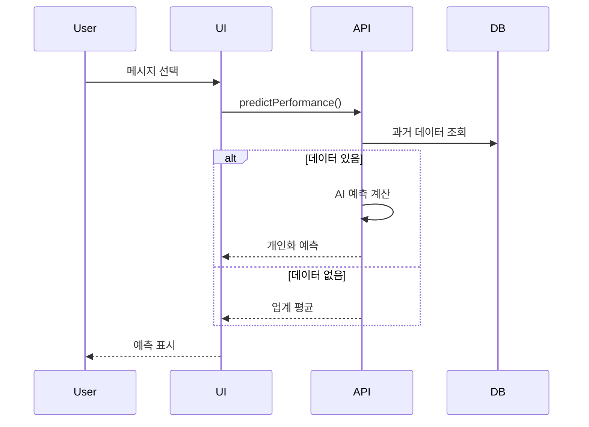
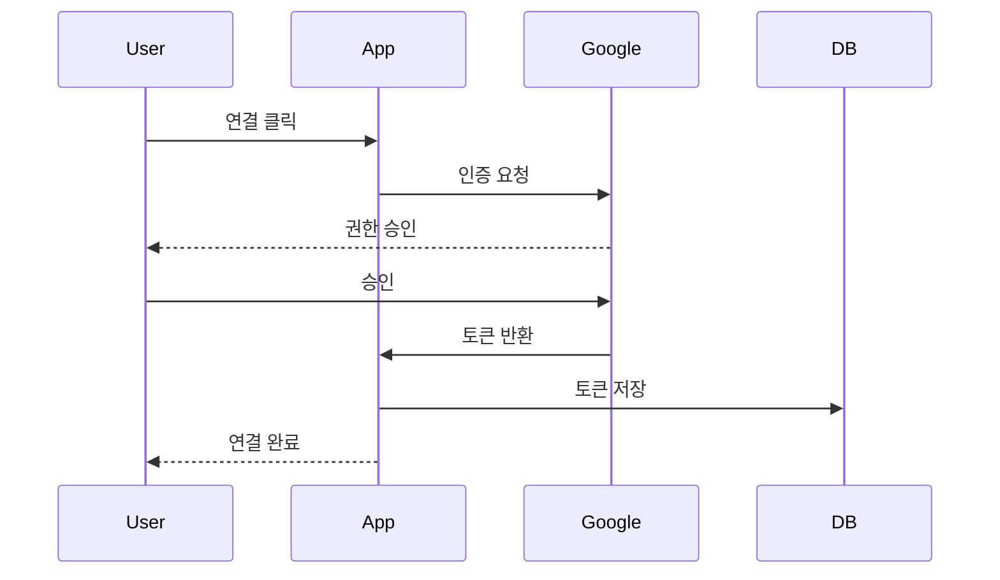

# CRM 메시지 자동 작성 & 성과 예측 툴 - 코드 아키텍처

## 목차
1. [기술 스택](#1-기술-스택)
2. [프로젝트 구조](#2-프로젝트-구조)
3. [시스템 아키텍처](#3-시스템-아키텍처)
4. [컴포넌트 아키텍처](#4-컴포넌트-아키텍처)
5. [API 설계](#5-api-설계)
6. [데이터베이스 스키마](#6-데이터베이스-스키마)
7. [인증 및 권한](#7-인증-및-권한)
8. [상태 관리](#8-상태-관리)
9. [성능 최적화](#9-성능-최적화)
10. [배포 및 인프라](#10-배포-및-인프라)
11. [개발 워크플로우](#11-개발-워크플로우)

---

## 1. 기술 스택

### 1.1 Core Technologies

#### Frontend Framework
```json
{
  "next": "15.5.0",
  "react": "19.2.3",
  "react-dom": "19.2.3",
  "typescript": "5.9.0"
}
```

**선택 이유**:
- **Next.js 15.5**: 최신 안정화 버전 (2025년 8월 릴리스), App Router 완전 지원
- **React 19.2.3**: 최신 안정화 버전 (2025년 12월 릴리스), 향상된 성능
- **TypeScript 5.9**: 최신 안정화 버전, 개선된 타입 추론

#### Styling & UI
```json
{
  "tailwindcss": "4.1.0",
  "shadcn/ui": "2.5.0",
  "@radix-ui/react-*": "latest",
  "class-variance-authority": "^0.7.0",
  "clsx": "^2.1.0",
  "tailwind-merge": "^2.2.0"
}
```

**선택 이유**:
- **Tailwind CSS 4.1**: 새로운 고성능 엔진, `@theme` 지시어 지원
- **shadcn/ui 2.5.0**: 커스터마이징 가능, Radix UI 기반
- 디자인 가이드의 토스 스타일 구현에 최적

#### AI & External APIs
```json
{
  "openai": "^4.28.0",
  "googleapis": "^134.0.0",
  "@google-cloud/local-auth": "^3.0.1"
}
```

**선택 이유**:
- **OpenAI SDK**: GPT-4.1 API 통합
- **Google APIs**: Google Sheets 연동, OAuth 2.0

#### Database & ORM
```json
{
  "@vercel/postgres": "^0.10.0",
  "drizzle-orm": "^0.36.0",
  "drizzle-kit": "^0.28.0"
}
```

**선택 이유**:
- **Vercel Postgres**: 서버리스 PostgreSQL, 제로 설정
- **Drizzle ORM**: 타입 안전, 경량, Next.js 완벽 호환

#### Form & Validation
```json
{
  "react-hook-form": "^7.53.0",
  "zod": "^3.23.0",
  "@hookform/resolvers": "^3.9.0"
}
```

#### Utilities
```json
{
  "date-fns": "^3.6.0",
  "lucide-react": "^0.460.0",
  "next-themes": "^0.4.0",
  "sonner": "^1.5.0"
}
```

---

## 2. 프로젝트 구조

### 2.1 폴더 구조

```
ai-부트캠프-프로젝트/
├── src/
│   ├── app/                          # Next.js App Router
│   │   ├── (main)/                   # 메인 라우트 그룹
│   │   │   ├── dashboard/
│   │   │   │   └── page.tsx
│   │   │   ├── campaign/
│   │   │   │   ├── new/
│   │   │   │   │   └── page.tsx
│   │   │   │   └── [id]/
│   │   │   │       └── page.tsx
│   │   │   ├── templates/
│   │   │   │   └── page.tsx
│   │   │   ├── settings/
│   │   │   │   └── page.tsx
│   │   │   └── layout.tsx
│   │   ├── api/                      # API Routes
│   │   │   ├── ai/
│   │   │   │   ├── generate/route.ts
│   │   │   │   └── predict/route.ts
│   │   │   ├── sheets/
│   │   │   │   ├── auth/route.ts
│   │   │   │   ├── sync/route.ts
│   │   │   │   └── callback/route.ts
│   │   │   ├── campaigns/route.ts
│   │   │   ├── templates/route.ts
│   │   │   └── settings/route.ts
│   │   ├── layout.tsx
│   │   └── globals.css
│   │
│   ├── components/
│   │   ├── ui/                       # shadcn/ui 컴포넌트
│   │   ├── layout/
│   │   ├── dashboard/
│   │   ├── campaign/
│   │   ├── template/
│   │   ├── settings/
│   │   └── shared/
│   │
│   ├── lib/
│   │   ├── api/
│   │   ├── db/
│   │   │   ├── schema.ts
│   │   │   └── queries/
│   │   ├── validations/
│   │   ├── utils/
│   │   ├── constants/
│   │   └── hooks/
│   │
│   ├── types/
│   └── styles/
│
├── public/
├── docs/
├── drizzle/
├── .env.local
├── next.config.js
├── tailwind.config.ts
├── tsconfig.json
└── package.json
```

### 2.2 명명 규칙

- **파일명**: `kebab-case.tsx`
- **컴포넌트명**: `PascalCase`
- **함수명**: `camelCase`
- **상수명**: `UPPER_SNAKE_CASE`

---

## 3. 시스템 아키텍처

### 3.1 전체 시스템 구조



### 3.2 캠페인 생성 플로우



### 3.3 성과 예측 플로우



---

## 4. 컴포넌트 아키텍처

### 4.1 Server Components vs Client Components

#### Server Components (기본)
```typescript
// app/(main)/dashboard/page.tsx
import { getCampaigns } from '@/lib/db/queries/campaigns';

export default async function DashboardPage() {
  const campaigns = await getCampaigns();
  
  return (
    <div>
      <h1>대시보드</h1>
      {/* 컴포넌트 */}
    </div>
  );
}
```

#### Client Components
```typescript
// components/campaign/campaign-form.tsx
'use client';

import { useForm } from 'react-hook-form';

export function CampaignForm() {
  const form = useForm();
  
  return <form>{/* 폼 */}</form>;
}
```

### 4.2 Tailwind 설정

```typescript
// tailwind.config.ts
const config = {
  theme: {
    extend: {
      colors: {
        primary: {
          DEFAULT: '#5FB3B3',
          hover: '#4A9999',
        },
        secondary: '#1E293B',
        background: {
          primary: '#FFFFFF',
          secondary: '#F8FAFC',
        },
        text: {
          primary: '#1E293B',
          secondary: '#475569',
        },
      },
      fontFamily: {
        sans: ['var(--font-pretendard)', 'system-ui'],
      },
      spacing: {
        xs: '4px',
        sm: '8px',
        md: '12px',
        base: '16px',
        lg: '24px',
        xl: '32px',
      },
    },
  },
};
```

### 4.3 버튼 컴포넌트

```typescript
// components/ui/button.tsx
import { cva } from 'class-variance-authority';

const buttonVariants = cva(
  'inline-flex items-center justify-center rounded-md',
  {
    variants: {
      variant: {
        primary: 'bg-primary text-white hover:bg-primary-hover',
        secondary: 'bg-white border border-border',
      },
      size: {
        default: 'h-12 px-6',
        sm: 'h-10 px-4',
      },
    },
  }
);
```

---

## 5. API 설계

### 5.1 AI 메시지 생성

```typescript
// app/api/ai/generate/route.ts
import { OpenAI } from 'openai';

const openai = new OpenAI({
  apiKey: process.env.OPENAI_API_KEY,
});

export async function POST(request: Request) {
  const body = await request.json();
  
  const completion = await openai.chat.completions.create({
    model: 'gpt-4.1',
    messages: [
      {
        role: 'system',
        content: '메시지 작성 규칙...',
      },
      {
        role: 'user',
        content: `캠페인 정보: ${JSON.stringify(body)}`,
      },
    ],
  });
  
  return Response.json({ messages: completion.choices });
}
```

### 5.2 성과 예측

```typescript
// app/api/ai/predict/route.ts
export async function POST(request: Request) {
  const { message } = await request.json();
  
  const historicalData = await getPerformanceData();
  
  if (!historicalData.length) {
    return Response.json({
      ctr: 4.1,
      conversion: 2.0,
      source: 'industry_average',
    });
  }
  
  const prediction = calculatePrediction(message, historicalData);
  return Response.json(prediction);
}
```

### 5.3 Google Sheets 연동

```typescript
// app/api/sheets/auth/route.ts
import { google } from 'googleapis';

const oauth2Client = new google.auth.OAuth2(
  process.env.GOOGLE_CLIENT_ID,
  process.env.GOOGLE_CLIENT_SECRET,
  process.env.GOOGLE_REDIRECT_URI
);

export async function GET() {
  const authUrl = oauth2Client.generateAuthUrl({
    access_type: 'offline',
    scope: ['https://www.googleapis.com/auth/spreadsheets.readonly'],
  });
  
  return Response.json({ authUrl });
}
```

---

## 6. 데이터베이스 스키마

### 6.1 Drizzle ORM 스키마

```typescript
// lib/db/schema.ts
import { pgTable, text, timestamp, uuid, real, jsonb } from 'drizzle-orm/pg-core';

export const campaigns = pgTable('campaigns', {
  id: uuid('id').defaultRandom().primaryKey(),
  title: text('title').notNull(),
  purpose: text('purpose').notNull(),
  target: text('target').notNull(),
  tone: text('tone').notNull(),
  messages: jsonb('messages').$type<Message[]>(),
  selectedMessage: jsonb('selected_message').$type<Message>(),
  predictedCtr: real('predicted_ctr'),
  status: text('status').default('draft'),
  createdAt: timestamp('created_at').defaultNow(),
});

export const templates = pgTable('templates', {
  id: uuid('id').defaultRandom().primaryKey(),
  name: text('name').notNull(),
  purpose: text('purpose').notNull(),
  target: text('target').notNull(),
  tone: text('tone').notNull(),
  createdAt: timestamp('created_at').defaultNow(),
});

export const settings = pgTable('settings', {
  id: uuid('id').defaultRandom().primaryKey(),
  titleMaxLength: integer('title_max_length').default(20),
  subtitleMaxLength: integer('subtitle_max_length').default(16),
  writingRules: jsonb('writing_rules').$type<string[]>(),
  forbiddenWords: jsonb('forbidden_words').$type<string[]>(),
});

export const performanceData = pgTable('performance_data', {
  id: uuid('id').defaultRandom().primaryKey(),
  campaignName: text('campaign_name').notNull(),
  sendDate: text('send_date').notNull(),
  ctr: real('ctr').notNull(),
  conversionRate: real('conversion_rate').notNull(),
});
```

### 6.2 쿼리 함수

```typescript
// lib/db/queries/campaigns.ts
import { db } from '@/lib/db';
import { campaigns } from '@/lib/db/schema';

export async function getCampaigns() {
  return await db.select().from(campaigns);
}

export async function createCampaign(data) {
  return await db.insert(campaigns).values(data).returning();
}
```

---

## 7. 인증 및 권한

### 7.1 Google OAuth 플로우



### 7.2 환경 변수

```bash
# .env.local
OPENAI_API_KEY=sk-...
GOOGLE_CLIENT_ID=...
GOOGLE_CLIENT_SECRET=...
POSTGRES_URL=...
ENCRYPTION_KEY=...
```

---

## 8. 상태 관리

### 8.1 Context API

```typescript
// lib/contexts/campaign-context.tsx
'use client';

import { createContext, useContext, useState } from 'react';

const CampaignContext = createContext(undefined);

export function CampaignProvider({ children }) {
  const [messages, setMessages] = useState([]);
  
  return (
    <CampaignContext.Provider value={{ messages, setMessages }}>
      {children}
    </CampaignContext.Provider>
  );
}

export function useCampaign() {
  return useContext(CampaignContext);
}
```

---

## 9. 성능 최적화

### 9.1 렌더링 전략

```typescript
// Static Generation
export const dynamic = 'force-static';
export const revalidate = 3600;

// ISR
export const revalidate = 300;

// SSR
export const dynamic = 'force-dynamic';
```

### 9.2 코드 스플리팅

```typescript
import dynamic from 'next/dynamic';

const MessageComparison = dynamic(
  () => import('@/components/campaign/message-comparison'),
  { ssr: false }
);
```

---

## 10. 배포 및 인프라

### 10.1 Vercel 설정

```json
// vercel.json
{
  "framework": "nextjs",
  "regions": ["icn1"],
  "headers": [
    {
      "source": "/(.*)",
      "headers": [
        {
          "key": "X-Content-Type-Options",
          "value": "nosniff"
        }
      ]
    }
  ]
}
```

```javascript
// next.config.js
const nextConfig = {
  reactStrictMode: true,
  swcMinify: true,
  images: {
    formats: ['image/avif', 'image/webp'],
  },
};
```

---

## 11. 개발 워크플로우

### 11.1 초기 설정

```bash
# 프로젝트 생성
npx create-next-app@latest crm-ai-tool --typescript --tailwind --app

cd crm-ai-tool

# 의존성 설치
npm install openai googleapis @google-cloud/local-auth
npm install @vercel/postgres drizzle-orm drizzle-kit
npm install react-hook-form zod @hookform/resolvers
npm install class-variance-authority clsx tailwind-merge
npm install lucide-react date-fns sonner

# shadcn/ui 초기화
npx shadcn@latest init

# 컴포넌트 추가
npx shadcn@latest add button input card select textarea badge
```

### 11.2 Git 워크플로우

```
main (프로덕션)
  └── develop (개발)
       ├── feature/dashboard
       ├── feature/campaign
       └── feature/ai-integration
```

### 11.3 Commit Convention

```
feat: 새로운 기능
fix: 버그 수정
docs: 문서 수정
style: 코드 포맷팅
refactor: 리팩토링

예시:
feat: AI 메시지 생성 API 구현
fix: 캠페인 폼 검증 오류 수정
```

### 11.4 개발 스크립트

```json
{
  "scripts": {
    "dev": "next dev",
    "build": "next build",
    "start": "next start",
    "lint": "next lint",
    "db:generate": "drizzle-kit generate:pg",
    "db:push": "drizzle-kit push:pg"
  }
}
```

---

## 부록

### A. 유용한 리소스

- [Next.js 15 Documentation](https://nextjs.org/docs)
- [React 19 Documentation](https://react.dev)
- [Tailwind CSS v4](https://tailwindcss.com/docs)
- [shadcn/ui](https://ui.shadcn.com)
- [Drizzle ORM](https://orm.drizzle.team)
- [OpenAI API](https://platform.openai.com/docs)

### B. 체크리스트

#### 성능
- [ ] 이미지 최적화
- [ ] 코드 스플리팅
- [ ] API 캐싱
- [ ] Edge Functions

#### 보안
- [ ] 환경 변수 암호화
- [ ] API 키 보호
- [ ] HTTPS 사용
- [ ] Rate Limiting

---

## 문서 정보

- **작성일**: 2026-01-22
- **버전**: 1.0
- **기반 문서**: service_plan.md, wireframes.md, design_guide.md
- **기술 스택 기준일**: 2026-01-22

### 수정 이력
- v1.0 (2026-01-22): 초기 작성
  - 최신 안정화 버전 기술 스택 선정
  - 프로젝트 구조 및 아키텍처 설계
  - API 및 데이터베이스 스키마 정의
  - Vercel 배포 설정

---

**이 문서는 프로젝트 개발 과정에서 지속적으로 업데이트됩니다.**
